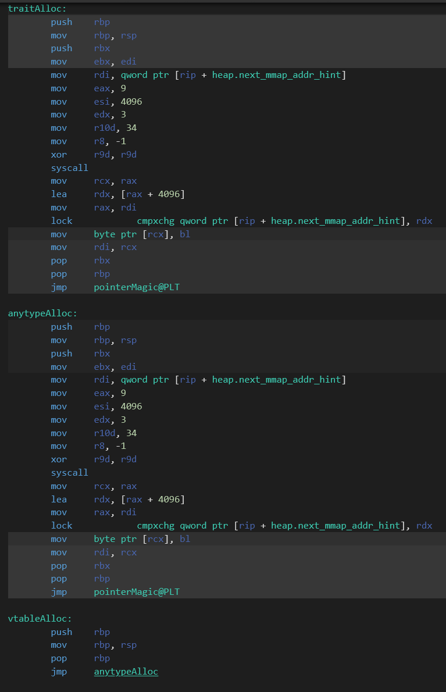

# Performance Comparison

This document analyzes the code generation differences between three approaches to generic allocation:

1. `anytype` parameter
2. Dynamic vtable (std.mem.Allocator)
3. Trait-based allocator (spindle.Allocator)

## Test Code

The test compared three functionally equivalent implementations:

```zig
// Using anytype
fn anytypeAllocU8(alloc: anytype, val: u8) *u8 {
    const ptr = alloc.create(u8) catch unreachable;
    ptr.* = val;
    return ptr;
}

// Using std.mem.Allocator vtable
fn vtableAllocU8(alloc: std.mem.Allocator, val: u8) *u8 {
    const ptr = alloc.create(u8) catch unreachable; 
    ptr.* = val;
    return ptr;
}

// Using spindle's trait
fn traitAllocU8(alloc: spd.Allocator, val: u8) *u8 {
    const ptr = alloc.create(u8) catch unreachable;
    ptr.* = val; 
    return ptr;
}
```

## Results

When compiled with `-OReleaseFast` (on godbolt with zig trunk), all three implementations generate identical assembly:

```zig
// External function that does something with the pointer
extern fn pointerMagic(ptr: *u8) void;

// Benchmark using std.mem.Allocator vtable
export fn vtableAlloc(val: u8) void {
    const alloc = std.heap.page_allocator;
    const ptr = vtableAllocU8(alloc, val);
    pointerMagic(ptr);
}

// Benchmark using spindle's trait
export fn traitAlloc(val: u8) void {
    const alloc = std.heap.page_allocator;
    const ptr = traitAllocU8(.allocator(alloc), val); 
    pointerMagic(ptr);
}

// Benchmark using anytype
export fn anytypeAlloc(val: u8) void {
    const alloc = std.heap.page_allocator;
    const ptr = anytypeAllocU8(alloc, val);
    pointerMagic(ptr);
}
```

## Godbolt Results

When compiled with `-OReleaseFast`, all three implementations generate identical assembly:

[](https://godbolt.org/z/Pe5cPb8Gj)  

> Note: Click the image or [this link](https://godbolt.org/z/Pe5cPb8Gj) to view the full interactive Godbolt comparison.

We see that all three implementations generate identical assembly:

The anytype gets monomorphized and the actual functions inlined. The vtable gets devirtualized and the trait-based allocator gets inlined.


